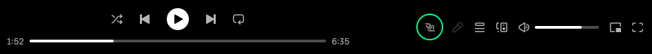

# spicetify-websocket-client

Unlock access to Spotify's Player API functionality, **without the Spotify premium requirement**.

`spicetify-websocket-client` is a [Spicetify](https://github.com/spicetify/cli) extension that enables websocket communication between Spotify desktop client and a websocket server.
It does two things:

- Sends outgoing events to the websocket server such as song change
- Receives incoming websocket events that control playback actions such as next song, previous song, and volume changes

The extension adds a small control button inside Spotify and exposes settings for the websocket address, port, endpoint, and auto-connect behavior.

## Features

Let your websocket control the Spotify application:

- play, pause or toggle play
- mute/unmute
- volume control
- play specific track by URl or URL
- skip forward, skip back or seek within a track
- set or toggle repeat
- set or toggle shuffle
- add or remove a track to or from a queue

Furthermore, your websocket server will receive a song change notification whenever a new track is being played in the Spotify app.

## Installation

TODO: Add user installation guide

If the extension was installed successfully, a websocket icon should appear at the bottom right




## Websocket behavior

### Websocket settings

The extension adds its websocket configuration to Spotify settings under `Websocket integration`.

Available settings:

- `Address` default: `127.0.0.1`
- `Port` default: `9090`
- `Endpoint` default: `/`
- `Start on launch` default: `false`

### Websocket message format

Outgoing websocket messages and incoming websocket requests use slightly different naming:

- Outgoing events sent by this extension use `eventName`.
- Incoming requests received by this extension use `requestName`.

Incoming requests are JSON strings with this general structure:

```json5
{
    "requestName": "<request>",
    "requestId": "optional-id",
    "callback": true,
    "payload": {}
}
```

Fields:

- `requestName`: The request handler to execute.
- `requestId`: Optional. When a handler sends a response, the `requestId` is usually echoed back so the server can correlate responses to requests.
- `callback`: Optional. For most non-GET requests, a response is sent when `callback` is omitted or `true`. Set `callback` to `false` to suppress that response. GET requests always send a response.
- `payload`: Request-specific data. Use `{}` when the request does not need data.

Most responses use this structure:

```json5
{
    "eventName": "Response",
    "status": "ok",
    "requestName": "<request>",
    "requestId": "optional-id",
    "message": "Only present for some errors",
    "payload": {}
}
```

If an unknown `requestName` is received, the extension sends an error response. If the incoming message cannot be parsed or another error is thrown while handling it, the extension sends a generic error response.

### Outgoing events

#### `SongChanged`

The extension sends a `SongChanged` event when Spicetify emits a `songchange` player event. It also tries to send an initial `SongChanged` event after the websocket listeners are registered, so the server receives the currently playing track without waiting for the next song change.

The old `SongChanged` payload containing `title`, `artist`, and `song` has been replaced with a normalized `PlayerTrack` payload.

```json5
{
    "eventName": "SongChanged",
    "payload": {
        "type": "track",
        "uri": "spotify:track:5cP52DlDN9yryuZVQDg3iq",
        "name": "SongName",
        "mediaType": "audio",
        "duration": 225000,
        "album": {
            "uri": "spotify:album:albumId",
            "name": "AlbumName",
            "images": [
                {
                    "url": "https://...",
                    "label": "standard"
                }
            ]
        },
        "artists": [
            {
                "uri": "spotify:artist:artistId",
                "name": "ArtistName"
            }
        ],
        "images": [
            {
                "url": "https://...",
                "label": "standard"
            }
        ]
    }
}
```

Payload fields:

- `type`: The Spicetify track type.
- `uri`: The Spotify URI of the track.
- `name`: The track name.
- `mediaType`: The media type reported by Spicetify.
- `duration`: Track duration in milliseconds.
- `album`: Album information.
- `album.uri`: Spotify URI of the album.
- `album.name`: Album name.
- `album.images`: Optional album image list.
- `artists`: Optional artist list.
- `images`: Optional track image list.

If no current track data is available, no `SongChanged` message is sent.

### Incoming requests

#### Playback controls

These requests do not require payload data.

| Request | Payload | Behavior |
| --- | --- | --- |
| `Play` | `{}` | Calls `Spicetify.Player.play()`, which resumes playback. |
| `Pause` | `{}` | Calls `Spicetify.Player.pause()`, which pauses playback. |
| `TogglePlay` | `{}` | Calls `Spicetify.Player.togglePlay()`, which toggles between play and pause. |
| `NextSong` | `{}` | Calls `Spicetify.Player.next()`, which skips to the next track. |
| `Back` | `{}` | Calls `Spicetify.Player.back()`, which skips to the previous track. |
| `PreviousSong` | `{}` | Calls `Spicetify.Player.skipBack(99999999)` and then `Spicetify.Player.back()`. This first seeks backward by a very large amount and then triggers the previous-track behavior. |
| `DecreaseVolume` | `{}` | Calls `Spicetify.Player.decreaseVolume()`, which decreases the volume by a client-determined amount. |
| `IncreaseVolume` | `{}` | Calls `Spicetify.Player.increaseVolume()`, which increases the volume by a client-determined amount. |
| `ToggleShuffle` | `{}` | Calls `Spicetify.Player.toggleShuffle()`, which toggles shuffle. |
| `ToggleRepeat` | `{}` | Calls `Spicetify.Player.toggleRepeat()`, which cycles repeat mode between no repeat, repeat all, and repeat one. |
| `ToggleMute` | `{}` | Calls `Spicetify.Player.toggleMute()`, which toggles mute. |
| `ToggleHeart` | `{}` | Calls `Spicetify.Player.toggleHeart()`, which saves or unsaves the current track. |
| `ClearQueue` | `{}` | Calls `Spicetify.Platform.PlayerAPI.clearQueue()`, which clears the current queue. |

Example:

```json5
{
    "requestName": "TogglePlay",
    "requestId": "toggle-1",
    "payload": {}
}
```

#### Track URI and URL requests

These requests only accept Spotify track URIs or Spotify track URLs. Album, playlist, artist, and other URI/URL types are rejected.

| Request | Payload | Behavior |
| --- | --- | --- |
| `PlayUri` | `{ "uri": "spotify:track:<id>" }` | Validates that `uri` is a Spotify track URI, then calls `Spicetify.Player.playUri(uri)`, which starts playback of the specified track. |
| `PlayUrl` | `{ "url": "https://open.spotify.com/track/<id>" }` | Converts the Spotify track URL to a Spotify track URI, validates it, then calls `Spicetify.Player.playUri(uri)`. |
| `AddToQueueUri` | `{ "uri": "spotify:track:<id>" }` | Validates that `uri` is a Spotify track URI, then calls `Spicetify.addToQueue([{ uri }])`. |
| `AddToQueueUrl` | `{ "url": "https://open.spotify.com/track/<id>" }` | Converts the Spotify track URL to a Spotify track URI, validates it, then calls `Spicetify.addToQueue([{ uri }])`. |
| `RemoveFromQueueUri` | `{ "uri": "spotify:track:<id>" }` | Validates that `uri` is a Spotify track URI, then calls `Spicetify.removeFromQueue([{ uri }])`. |
| `RemoveFromQueueUrl` | `{ "url": "https://open.spotify.com/track/<id>" }` | Converts the Spotify track URL to a Spotify track URI, validates it, then calls `Spicetify.removeFromQueue([{ uri }])`. |

Example:

```json5
{
    "requestName": "PlayUri",
    "requestId": "play-uri-1",
    "payload": {
        "uri": "spotify:track:5cP52DlDN9yryuZVQDg3iq"
    }
}
```

Example:

```json5
{
    "requestName": "AddToQueueUrl",
    "requestId": "queue-url-1",
    "payload": {
        "url": "https://open.spotify.com/track/3mRM4NM8iO7UBqrSigCQFH?si=eeaec6fba1a74821"
    }
}
```

#### Player state setters and seeking

| Request | Payload | Behavior |
| --- | --- | --- |
| `SetShuffle` | `{ "state": true }` | Calls `Spicetify.Player.setShuffle(state)`, which sets shuffle to the provided boolean. |
| `SetMute` | `{ "state": true }` | Calls `Spicetify.Player.setMute(state)`, which sets mute to the provided boolean. |
| `SetHeart` | `{ "status": true }` | Calls `Spicetify.Player.setHeart(status)`, which sets the heart/save state of the current track. |
| `SetRepeat` | `{ "mode": 0 }` | Calls `Spicetify.Player.setRepeat(mode)`. Valid repeat modes are `0` for no repeat, `1` for repeat all, and `2` for repeat one. |
| `SetVolume` | `{ "level": 0.5 }` | Calls `Spicetify.Player.setVolume(level)`. `level` is expected to be a number between `0` and `1`. The handler clamps the value before sending it to Spicetify, so values below `0` become `0` and values above `1` become `1`. |
| `Seek` | `{ "position": 60000 }` | Calls `Spicetify.Player.seek(position)`. Spicetify accepts either a percentage from `0` to `1` or a position in milliseconds. |
| `SkipForward` | `{ "amount": 15000 }` | Calls `Spicetify.Player.skipForward(amount)`, which skips forward by the specified number of milliseconds. |
| `SkipBack` | `{ "amount": 15000 }` | Calls `Spicetify.Player.skipBack(amount)`, which skips backward by the specified number of milliseconds. |

Example `SetVolume` request:

```json5
{
    "requestName": "SetVolume",
    "requestId": "volume-1",
    "payload": {
        "level": 0.5
    }
}
```

Example `Seek` request using milliseconds:

```json5
{
    "requestName": "Seek",
    "requestId": "seek-1",
    "payload": {
        "position": 60000
    }
}
```

Example `Seek` request using percentage:

```json5
{
    "requestName": "Seek",
    "requestId": "seek-2",
    "payload": {
        "position": 0.5
    }
}
```

### GET requests

GET requests do not require payload data and always send a `Response`.

Example:

```json5
{
    "requestName": "GetVolume",
    "requestId": "get-volume-1",
    "payload": {}
}
```

#### Simple player GET requests

| Request | Response payload | Behavior |
| --- | --- | --- |
| `GetDuration` | `{ "duration": 225000 }` | Calls `Spicetify.Player.getDuration()`, which returns the current track duration in milliseconds. |
| `GetMute` | `{ "state": false }` | Calls `Spicetify.Player.getMute()`, which returns the mute state. |
| `GetProgress` | `{ "progress": 60000 }` | Calls `Spicetify.Player.getProgress()`, which returns the current track progress in milliseconds. |
| `GetProgressPercent` | `{ "progressPercent": 0.5 }` | Calls `Spicetify.Player.getProgressPercent()`, which returns progress as a number from `0` to `1`. |
| `GetRepeat` | `{ "mode": 0 }` | Calls `Spicetify.Player.getRepeat()`, which returns `0` for no repeat, `1` for repeat all, or `2` for repeat one. |
| `GetShuffle` | `{ "state": true }` | Calls `Spicetify.Player.getShuffle()`, which returns the shuffle state. |
| `GetHeart` | `{ "status": true }` | Calls `Spicetify.Player.getHeart()`, which returns whether the current track is saved/hearted. |
| `GetVolume` | `{ "level": 0.5 }` | Calls `Spicetify.Player.getVolume()`, which returns the current volume as a number from `0` to `1`. |

Example `GetVolume` response:

```json5
{
    "eventName": "Response",
    "status": "ok",
    "requestName": "GetVolume",
    "requestId": "get-volume-1",
    "payload": {
        "level": 0.5
    }
}
```

#### Track and player data GET requests

These requests read from `Spicetify.Player.data`.

| Request | Response payload | Behavior |
| --- | --- | --- |
| `GetPlayerState` | Full `Spicetify.PlayerState` object | Sends `Spicetify.Player.data` as the response payload. If no player state is available, the response status is `error` and the message is `No playerstate available`. |
| `GetCurrentTrack` | `PlayerTrack` | Converts `Spicetify.Player.data.item` to the same normalized `PlayerTrack` shape used by `SongChanged`. |
| `GetNextTracks` | `{ "tracks": PlayerTrack[] }` | Converts each item in `Spicetify.Player.data.nextItems` to the normalized `PlayerTrack` shape. If no next-track data is available, the response status is `error` and the message is `No next tracks data available`. |
| `GetPreviousTrack` | `PlayerTrack` | Converts the first item in `Spicetify.Player.data.previousItems` to the normalized `PlayerTrack` shape. If no previous-track data is available, the response status is `error` and the message is `No previous track data available`. |

`PlayerTrack` response shape:

```json5
{
    "type": "track",
    "uri": "spotify:track:5cP52DlDN9yryuZVQDg3iq",
    "name": "SongName",
    "mediaType": "audio",
    "duration": 225000,
    "album": {
        "uri": "spotify:album:albumId",
        "name": "AlbumName",
        "images": [
            {
                "url": "https://...",
                "label": "standard"
            }
        ]
    },
    "artists": [
        {
            "uri": "spotify:artist:artistId",
            "name": "ArtistName"
        }
    ],
    "images": [
        {
            "url": "https://...",
            "label": "standard"
        }
    ]
}
```

Example `GetNextTracks` response:

```json5
{
    "eventName": "Response",
    "status": "ok",
    "requestName": "GetNextTracks",
    "payload": {
        "tracks": [
            {
                "type": "track",
                "uri": "spotify:track:5cP52DlDN9yryuZVQDg3iq",
                "name": "SongName",
                "mediaType": "audio",
                "duration": 225000,
                "album": {
                    "uri": "spotify:album:albumId",
                    "name": "AlbumName",
                    "images": [
                        {
                            "url": "https://...",
                             "label": "standard"
                        }
                    ]
                },
                "artists": [
                    {
                        "uri": "spotify:artist:artistId",
                        "name": "ArtistName"
                    }
                ],

                "images": [
                        {
                            "url": "https://...",
                             "label": "standard"
                        }
                    ]
            }
        ]
    }
}
```

## Integrating with Streamer.bot

This project was initially created to be used with a custom websocket server in [Streamer.bot](https://streamer.bot/)

_TODO_ Collection of streamerbot C# scripts that can be used, along with handling the handshake

## Development

### Prerequisites

Before building this extension, make sure you have:

- [Node.js](https://nodejs.org/) and `npm`
- the Spotify desktop client
- [Spicetify CLI](https://github.com/spicetify/cli) installed and working
- a valid Spicetify setup that has already been applied to Spotify at least once

### Build

Install dependencies:

```bash
npm install
```

Build the extension:

```bash
npm run build
```

or build and apply immediately:

```bash
npm start
```

this is the same as

```bash
npm run build
spicetify apply
```

### Add to Spicetify Config

After building, enable the extension in Spicetify:

```bash
spicetify config extensions spicetify-websocket-client.js
spicetify apply
```

### Adding new events

If you want to extend the websocket event system, see the dedicated guides:

- Incoming requests: [src/websocket/incoming/README.md](src/websocket/incoming/README.md)
- Outgoing events: [src/websocket/outgoing/README.md](src/websocket/outgoing/README.md)
