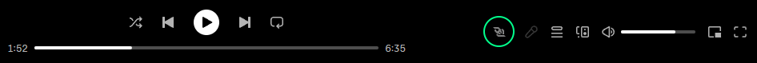
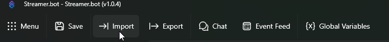
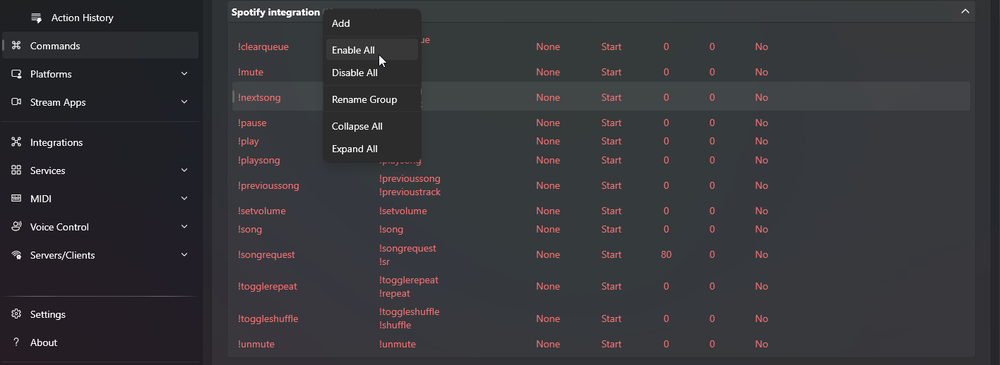
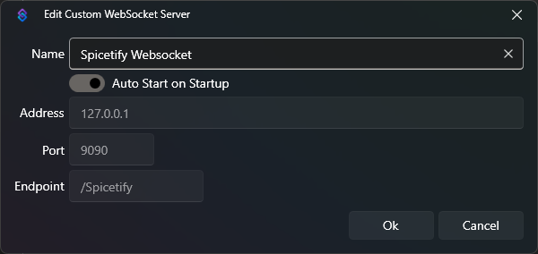
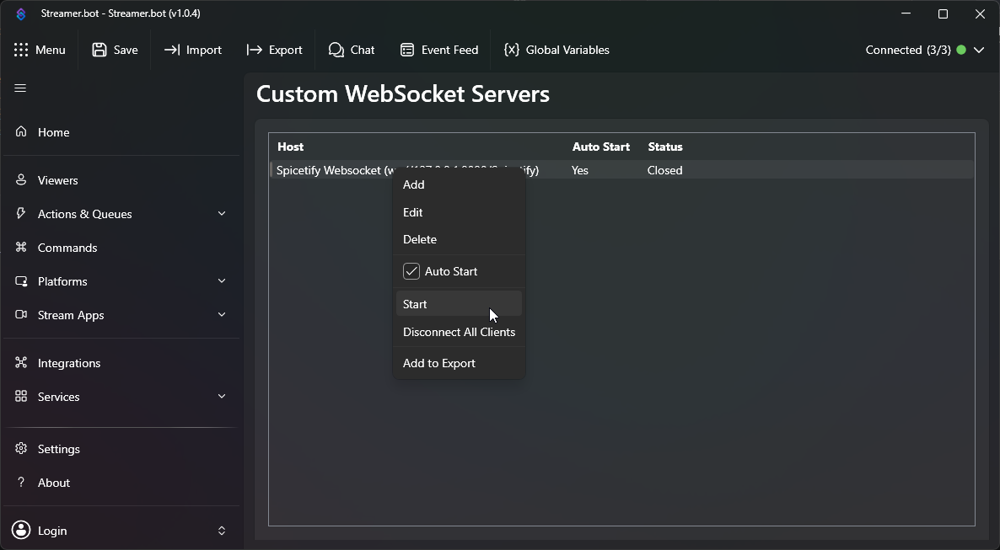
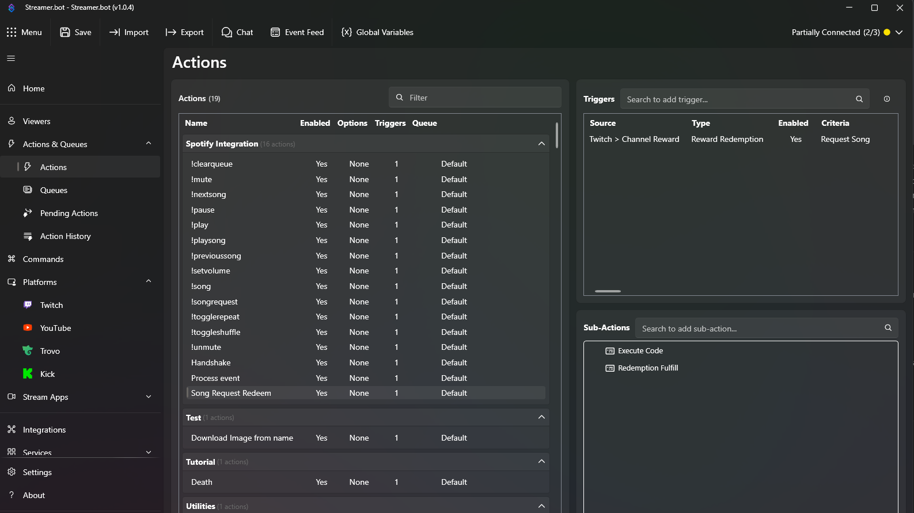
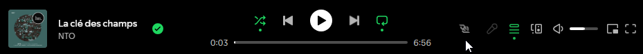
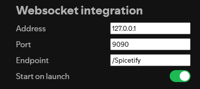
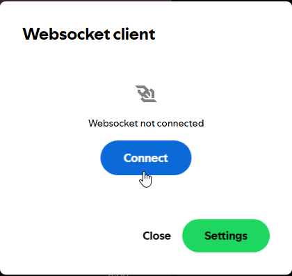

# spicetify-websocket-client

Control Spotify and react to what it is playing, from your own application.

`spicetify-websocket-client` enables websocket communication between the Spotify desktop client and a websocket server.
It does two things:

- Sends outgoing events to the websocket server such as song change
- Receives incoming websocket events that control playback actions such as next song, previous song, and volume changes

It works with any websocket server, and can run either as a [Spicetify extension](#installation) or [standalone](#running-standalone-without-spicetify), without Spicetify installed. Both use the same websocket API, so everything documented below applies to either.

As a Spicetify extension it adds a small control button inside Spotify and exposes settings for the websocket address, port, endpoint, and auto-connect behavior. Standalone it runs without any interface and reads its settings from a file.

## Features

Let your websocket control the Spotify application:

- play, pause or toggle play
- mute/unmute
- volume control
- play specific track by URI or URL
- skip forward, skip back or seek within a track
- set or toggle repeat
- set or toggle shuffle
- add or remove a track to or from a queue
- fetch current track, queued tracks and more

Furthermore, your websocket server will receive a song change notification whenever a new track is being played in the Spotify app.

## Installation

### Installing Spicetify

> [!IMPORTANT]
> An installation of Spotify directly from their website is required. If your current Spotify installation is from the Microsoft Store, uninstall it and reinstall directly from [Spotify](https://www.spotify.com/download) by clicking <ins>Download directly from Spotify</ins>.

To install [Spicetify](https://spicetify.app/) on top of your Spotify,  open Terminal and run the following commmand.

For Windows:
```iwr -useb https://raw.githubusercontent.com/spicetify/cli/main/install.ps1 | iex```

For macOS / Linux:
```curl -fsSL https://raw.githubusercontent.com/spicetify/cli/main/install.sh | sh```


### Installing our extension from Spicetify Marketplace

1. Navigate to the Spicetify Marketplace by clicking the basket in the top-left corner of your Spotify window.
2. Search for 'spicetify-websocket-client' and click 'Load more'.
3. Download the extension.

### Installing our extension manually

1. Download [`spicetify-websocket-client.js`](https://github.com/19EB/spicetify-websocket-client/blob/main/spicetify-websocket-client.js).

2. Place the file in the path:
   - Windows: `C:\Users\<user_name>\AppData\Roaming\spicetify\Extensions\`
   - Linux / macOS: `~/.config/spicetify/Extensions/`

3. Open Terminal and run the following commmand to enable the extension:
```bash
spicetify config extensions spicetify-websocket-client.js
```

4. Run the following command to apply the change:
```bash
spicetify apply
```


If the extension was installed successfully, a websocket icon should appear at the bottom right



## Fixing Spicetify after Spotify's update
Run the following command in Terminal.
```bash
spicetify backup apply
```

## Running standalone (without Spicetify)

The standalone build runs the same client without Spicetify. A small host program launches Spotify with its remote debugging port enabled, injects the client, and prints Spotify's log output to a terminal window. Your Spotify installation is not modified, so there is nothing to re-apply after a Spotify update.

> [!IMPORTANT]
> Like Spicetify, this requires Spotify installed directly from their website. If your current Spotify installation is from the Microsoft Store, uninstall it and reinstall directly from [Spotify](https://www.spotify.com/download) by clicking <ins>Download directly from Spotify</ins>.

### Setup

1. Download the standalone package from [Releases](https://github.com/19EB/spicetify-websocket-client/releases) and unzip it.

2. Open `websocket-client.ini` and set the address, port and endpoint of your websocket server.

```ini
[websocket]
address = 127.0.0.1
port = 9090
endpoint = /
startOnLaunch = true
```

3. Run `start.cmd` on Windows, or the `spotify-ws-host` binary on macOS and Linux.

The host is a single executable, so there is nothing to install.

**Note**: Spotify only accepts the remote debugging flag at launch, and allows one instance at a time. If Spotify is already running, the host closes and reopens it, so playback stops for a few seconds. Set `restart = false` under `[spotify]` to make it stop with an error instead.

Once connected, Spotify's log output appears in the terminal. Keep the window open so the client is reinjected whenever Spotify reloads. If you close it, the client keeps running until Spotify next reloads.

### Configuration

Settings are read from `websocket-client.ini` next to the executable. A different path can be given as the first argument.

`[websocket]`

| Key | Default | Description |
|---|---|---|
| `address` | `127.0.0.1` | Websocket server address |
| `port` | `9090` | Websocket server port |
| `endpoint` | `/` | Path on the server, for example `/spicetify` |
| `startOnLaunch` | `true` | Connect as soon as the client is injected |
| `reconnect` | `true` | Reconnect when the server goes away |
| `reconnectDelayMs` | `1000` | Delay before the first retry, doubled on each attempt |
| `reconnectMaxDelayMs` | `30000` | Longest delay between retries |

`[spotify]`

| Key | Default | Description |
|---|---|---|
| `debugPort` | `9223` | Local port the host uses to talk to Spotify |
| `restart` | `true` | Restart Spotify when the debug port is not open |
| `executable` | auto-detected | Path to Spotify, if it is not found automatically |

**Note**: While the host runs, Spotify listens on a local debug port. It is not reachable from other machines, but any program on your computer can use it to control Spotify. Change the port with `debugPort`, or close the terminal window when you are done.

### Troubleshooting

| Message | Cause |
|---|---|
| `could not find Spotify` | Set `executable` under `[spotify]` to the full path of Spotify |
| `Spotify did not open the debug port` | Usually the Microsoft Store version. Reinstall from spotify.com |
| `no page target matching xpui appeared` | Spotify was still starting. Run the host again |
| Connects, but your server receives nothing | `endpoint` does not match the path on your server |

## Integrating with Streamer.bot

This project was initially created to be used with a custom websocket server in [Streamer.bot](https://streamer.bot/). We have included a simple ready-to-use Streamerbot setup that lets you control your Spotify, request songs and fetch the currently playing song through Twitch chat.

1. Download and install the Streamerbot application, using the [Installation Guide](https://docs.streamer.bot/get-started/installation).

2. Connect your Streamerbot to your broadcasting software and Twitch account, using
   the [Initial Setup Guide](https://docs.streamer.bot/get-started/setup). Optionally, you can log in on a secondary Twitch account to let it function as your chat bot.

3. Copy the raw file of [StreamerbotSpotifyActions](https://github.com/19EB/spicetify-websocket-client/blob/main/resources/StreamerbotSpotifyActions).

4. Click `Import` and paste the raw file in the dialog box.



5. Go to `Commands` and enable all commands that came with the import.



6. Go to `Servers/Clients` > `Custom WebSocket Servers`, right-click `Spicetify Websocket` > `Start` and make sure to enable ✅ `Auto Start`. **Important**: If you happen to have another custom websocket server already setup, make sure to assign a unique endpoint, such as 'Spicetify'.
   
 

7. If you'd like to set up song requests through Twitch Channel Rewards, go to `Platforms` > `Twitch` > `Channel Point Rewards` and add the channel point reward with 'User input required' enabled. This reward will queue a spotify track belonging to the provided song link. Make sure to clarify this in the description. Choose your desired cost and cooldown. Navigate to `Actions & Queues` > `Actions` and select the action `Song Request Redeem` and make sure the **Triggers** box contains the Twitch Channel Reward you just made. Inside the **Triggers** box, right-click and select  `Add` > `Twitch` > `Channel Reward` > `Reward Redemption`, which will let you pick the reward you just made.



8. Open your Spotify with Spicetify and this extension. Click the websocket icon in the bottom and go to **Settings**. Enable 'Startup on launch' and make sure the `Adress`, `Port` and `Endpoint` match those of your Streamerbot's custom websocket server. You should now be able to let Spotify connect to the websocket server whenever Streamerbot is running and Spotify will try to autoconnect to the server on next startup.





If you are running [standalone](#running-standalone-without-spicetify), there is no settings page. Put the same address, port and endpoint in `websocket-client.ini` and start the host.

**Note**: For future use, always make sure to let Streamerbot load up for a while to ensure it has initialized before opening Spotify to ensure it's able to receive initial data. You can also simply disconnect and reconnect Spotify to ensure proper initialization. With reconnecting enabled, which is the default, the client will also recover on its own if Streamerbot is restarted.


The imported actions in Streamerbot intuitively do what their name suggests. Most of these are triggered by their corresponding chat command. You can disable the functions you don't want by either disabling their corresponding commands in the `Commands` section or by disabling the actions themselves. By default, chat commands that control your spotify in any way have been restricted to only you and your Twitch moderators.

Do **NOT** disable or alter `Process event`, `Handshake`, `Spicetify event signal`, `Spicetify response signal`, `Spicetify response signal var` or `Spotify Controls`. These are all part of core processes that make the bot function.

## Websocket settings and API

### Websocket settings

As a Spicetify extension, the websocket configuration is added to Spotify settings under `Websocket integration`. Standalone, the same settings are read from `websocket-client.ini`, see [Configuration](#configuration).

Available settings:

- `Address` default: `127.0.0.1`
- `Port` default: `9090`
- `Endpoint` default: `/`
- `Start on launch` default: `false`
- `Reconnect automatically` default: `true`
- `Reconnect delay (ms)` default: `1000`
- `Max reconnect delay (ms)` default: `30000`

When the server goes away, for example when Streamer.bot restarts, the client reconnects on its own. It waits `Reconnect delay` before the first attempt and doubles that up to `Max reconnect delay`. The initial player state is sent again once it reconnects.

### Websocket message format

Outgoing websocket messages and incoming websocket requests use slightly different naming:

- Outgoing events sent by this extension use `eventName`.
- Incoming requests received by this extension use `requestName`.

Incoming requests are JSON strings with this general structure:

```json5
{
    "requestName": "<request>",
    "requestId": "optional-id",
    "callback": true,
    "payload": {}
}
```

Fields:

- `requestName`: The request handler to execute.
- `requestId`: Optional. When a handler sends a response, the `requestId` is usually echoed back so the server can correlate responses to requests.
- `callback`: Optional. For most non-GET requests, a response is sent when `callback` is omitted or `true`. Set `callback` to `false` to suppress that response. GET requests always send a response.
- `payload`: Request-specific data. Use `{}` when the request does not need data.

Most responses use this structure:

```json5
{
    "eventName": "Response",
    "status": "ok",
    "requestName": "<request>",
    "requestId": "optional-id",
    "message": "Only present for some errors",
    "payload": {}
}
```

If an unknown `requestName` is received, the extension sends an error response. If the incoming message cannot be parsed or another error is thrown while handling it, the extension sends a generic error response.

### Shape of PlayerTrack and PlayerState

`PlayerTrack` payload shape:

```json5
{
  "type": "track",
  "uri": "spotify:track:5cP52DlDN9yryuZVQDg3iq",
  "name": "SongName",
  "mediaType": "audio",
  "duration": 225000,
  "album": {
    "uri": "spotify:album:albumId",
    "name": "AlbumName",
    "images": [
      {
        "url": "https://...",
        "label": "standard"
      }
    ]
  },
  "artists": [
    {
      "uri": "spotify:artist:artistId",
      "name": "ArtistName"
    }
  ],
  "images": [
    {
      "url": "https://...",
      "label": "standard"
    }
  ]
}
```

Payload fields:

- `type`: The Spicetify track type.
- `uri`: The Spotify URI of the track.
- `name`: The track name.
- `mediaType`: The media type reported by Spicetify.
- `duration`: Track duration in milliseconds.
- `album`: Album information.
- `album.uri`: Spotify URI of the album.
- `album.name`: Album name.
- `album.images`: Optional album image list.
- `artists`: Optional artist list.
- `images`: Optional track image list.

`PlayerState` payload shape:

```json5
{
  "isPlaying": true,
  "progress": 84231,
  "duration": 215447,
  "isMuted": false,
  "volume": 0.78,
  "isShuffling": true,
  "repeatMode": 1,
  "currentTrack": {
    "type": "track",
    "uri": "spotify:track:3n3Ppam7vgaVa1iaRUc9Lp",
    "name": "Mr. Brightside",
    "mediaType": "audio",
    "duration": 215447,
    "album": {
      "uri": "spotify:album:4piJq7R3gjUOxnYs6lDCTg",
      "name": "Hot Fuss",
      "images": [
        {
          "url": "https://i.scdn.co/image/ab67616d00001e024d0dc3f5e1b46d0f1d7cbcc1",
          "label": "640x640"
        }
      ]
    },
    "artists": [
      {
        "uri": "spotify:artist:0C0XlULifJtAgn6ZNCW2eu",
        "name": "The Killers"
      }
    ],
    "images": [
      {
        "url": "https://i.scdn.co/image/ab67616d00001e024d0dc3f5e1b46d0f1d7cbcc1",
        "label": "640x640"
      }
    ]
  },
  "previousTrack": {
    "type": "track",
    "uri": "spotify:track:0eGsygTp906u18L0Oimnem",
    "name": "Lose Yourself",
    "mediaType": "audio",
    "duration": 326466,
    "album": {
      "uri": "spotify:album:6t7956yu5zYf5A829XRiHC",
      "name": "8 Mile",
      "images": [
        {
          "url": "https://i.scdn.co/image/ab67616d00001e02f0b3f7d2f7f9d1f0c8b1a3ef",
          "label": "640x640"
        }
      ]
    },
    "artists": [
      {
        "uri": "spotify:artist:7dGJo4pcD2V6oG8kP0tJRR",
        "name": "Eminem"
      }
    ],
    "images": [
      {
        "url": "https://i.scdn.co/image/ab67616d00001e02f0b3f7d2f7f9d1f0c8b1a3ef",
        "label": "640x640"
      }
    ]
  },
  "nextTracks": [
    {
      "type": "track",
      "uri": "spotify:track:7ouMYWpwJ422jRcDASZB7P",
      "name": "Take Me Out",
      "mediaType": "audio",
      "duration": 237026,
      "album": {
        "uri": "spotify:album:0vi5ePiEHrGZJF7QhnDW2z",
        "name": "Franz Ferdinand",
        "images": [
          {
            "url": "https://i.scdn.co/image/ab67616d00001e02d3f3c8360e3b9a2b805d6e7c",
            "label": "640x640"
          }
        ]
      },
      "artists": [
        {
          "uri": "spotify:artist:0XNa1vTidXlvJ2gHSsRi4A",
          "name": "Franz Ferdinand"
        }
      ],
      "images": [
        {
          "url": "https://i.scdn.co/image/ab67616d00001e02d3f3c8360e3b9a2b805d6e7c",
          "label": "640x640"
        }
      ]
    }
  ]
}
```
Payload fields:

- `isPlaying`: The Play/Pause state, `true` if playing and `false` if paused.
- `progress`: The progress of the current song in milliseconds.
- `duration`: The duration of the current song in milliseconds.
- `isMuted`: The mute state of the player, `true` if muted and false otherwise.
- `volume`: A number between 0 and 1 indicating the volume level of the player.
- `isShuffling`: Indicating the shuffle state of the player, `true` if either regular or smart shuffle is enabled and `false` otherwise.
- `repeatMode`: A number indicating the repeat mode of the palyer. `0` for no repeat, `1` for repeat all and `2` for repeat one.
- `currentTrack`: A `PlayerTrack` object corresponding to the currently playing track.
- `previousTrack`: A `PlayerTrack` object corresponding to the peviously played track.
- `nextTracks`: A `PlayerTrack[]` object array corresponding to tracks in queue.


### Outgoing events

#### `SongChanged`

The extension sends a `SongChanged` event when a new track plays in Spotify. The payload will be a `PlayerTrack` object corresponding to the new track that's playing.

#### `InitialState`

Whenever a connection with a websocket server is established, the extension sends an `InitialState` event, including a `PlayerState` object as the payload.

#### `QueueChanged`

Whenever the queue of upcoming tracks is updated in Spotify, the extension sends a `QueueChanged` event, including a `PlayerTrack[]` object array as the payload.

#### `PlayPauseChanged`

Whenever the Play/Pause state of the player changes, a `PlayPauseChanged` event is sent with the payload containing a variable named `isPlaying`, with value `true` or `false`.

#### `VolumeChanged`

Whenever the volume level of the player changes, a `VolumeChanged` event is sent with the payload containing a variable named `level`, with a number value between `0` and `1`.

#### JSON examples

`SongChanged`:

```json5
{
  "eventName": "SongChanged",
  "payload": {
    "type": "track",
    "uri": "spotify:track:5cP52DlDN9yryuZVQDg3iq",
    "name": "SongName",
    "mediaType": "audio",
    "duration": 225000,
    "album": {
      "uri": "spotify:album:albumId",
      "name": "AlbumName",
      "images": [
        {
          "url": "https://...",
          "label": "standard"
        }
      ]
    },
    "artists": [
      {
        "uri": "spotify:artist:artistId",
        "name": "ArtistName"
      }
    ],
    "images": [
      {
        "url": "https://...",
        "label": "standard"
      }
    ]
  }
}
```

`PlayPauseChanged`:

```json5
{
  "eventName": "PlayPauseChanged",
  "payload": {
    "isPlaying": True
  }
}
```

`VolumeChanged`: 

```json5
{
  "eventName": "VolumeChanged",
  "payload": {
    "level": 0.73
  }
}
```

### Incoming requests

#### Playback controls

These requests do not require payload data.

| Request          | Payload | Behavior                                                                                                                                                                        |
| ---------------- | ------- | ------------------------------------------------------------------------------------------------------------------------------------------------------------------------------- |
| `Play`           | `{}`    | Calls `Spicetify.Player.play()`, which resumes playback.                                                                                                                        |
| `Pause`          | `{}`    | Calls `Spicetify.Player.pause()`, which pauses playback.                                                                                                                        |
| `TogglePlay`     | `{}`    | Calls `Spicetify.Player.togglePlay()`, which toggles between play and pause.                                                                                                    |
| `NextSong`       | `{}`    | Calls `Spicetify.Player.next()`, which skips to the next track.                                                                                                                 |
| `Back`           | `{}`    | Calls `Spicetify.Player.back()`, which skips to the previous track.                                                                                                             |
| `PreviousSong`   | `{}`    | Calls `Spicetify.Player.skipBack(99999999)` and then `Spicetify.Player.back()`. This first seeks backward by a very large amount and then triggers the previous-track behavior. |
| `DecreaseVolume` | `{}`    | Calls `Spicetify.Player.decreaseVolume()`, which decreases the volume by a client-determined amount.                                                                            |
| `IncreaseVolume` | `{}`    | Calls `Spicetify.Player.increaseVolume()`, which increases the volume by a client-determined amount.                                                                            |
| `ToggleShuffle`  | `{}`    | Calls `Spicetify.Player.toggleShuffle()`, which toggles shuffle.                                                                                                                |
| `ToggleRepeat`   | `{}`    | Calls `Spicetify.Player.toggleRepeat()`, which cycles repeat mode between no repeat, repeat all, and repeat one.                                                                |
| `ToggleMute`     | `{}`    | Calls `Spicetify.Player.toggleMute()`, which toggles mute.                                                                                                                      |
| `ToggleHeart`    | `{}`    | Calls `Spicetify.Player.toggleHeart()`, which saves or unsaves the current track.                                                                                               |
| `ClearQueue`     | `{}`    | Calls `Spicetify.Platform.PlayerAPI.clearQueue()`, which clears the current queue.                                                                                              |

Example:

```json5
{
    "requestName": "TogglePlay",
    "requestId": "toggle-1",
    "payload": {}
}
```

#### Track URI and URL requests

These requests only accept Spotify track URIs or Spotify track URLs. Album, playlist, artist, and other URI/URL types are rejected.

| Request              | Payload                                            | Behavior                                                                                                                               |
| -------------------- | -------------------------------------------------- | -------------------------------------------------------------------------------------------------------------------------------------- |
| `PlayUri`            | `{ "uri": "spotify:track:<id>" }`                  | Validates that `uri` is a Spotify track URI, then calls `Spicetify.Player.playUri(uri)`, which starts playback of the specified track. |
| `PlayUrl`            | `{ "url": "https://open.spotify.com/track/<id>" }` | Converts the Spotify track URL to a Spotify track URI, validates it, then calls `Spicetify.Player.playUri(uri)`.                       |
| `AddToQueueUri`      | `{ "uri": "spotify:track:<id>" }`                  | Validates that `uri` is a Spotify track URI, then calls `Spicetify.addToQueue([{ uri }])`.                                             |
| `AddToQueueUrl`      | `{ "url": "https://open.spotify.com/track/<id>" }` | Converts the Spotify track URL to a Spotify track URI, validates it, then calls `Spicetify.addToQueue([{ uri }])`.                     |
| `RemoveFromQueueUri` | `{ "uri": "spotify:track:<id>" }`                  | Validates that `uri` is a Spotify track URI, then calls `Spicetify.removeFromQueue([{ uri }])`.                                        |
| `RemoveFromQueueUrl` | `{ "url": "https://open.spotify.com/track/<id>" }` | Converts the Spotify track URL to a Spotify track URI, validates it, then calls `Spicetify.removeFromQueue([{ uri }])`.                |

Example:

```json5
{
    "requestName": "PlayUri",
    "requestId": "play-uri-1",
    "payload": {
        "uri": "spotify:track:5cP52DlDN9yryuZVQDg3iq"
    }
}
```

Example:

```json5
{
    "requestName": "AddToQueueUrl",
    "requestId": "queue-url-1",
    "payload": {
        "url": "https://open.spotify.com/track/3mRM4NM8iO7UBqrSigCQFH?si=eeaec6fba1a74821"
    }
}
```

#### Player state setters and seeking

| Request       | Payload                 | Behavior                                                                                                                                                                                                                        |
| ------------- | ----------------------- | ------------------------------------------------------------------------------------------------------------------------------------------------------------------------------------------------------------------------------- |
| `SetShuffle`  | `{ "state": true }`     | Calls `Spicetify.Player.setShuffle(state)`, which sets shuffle to the provided boolean.                                                                                                                                         |
| `SetMute`     | `{ "state": true }`     | Calls `Spicetify.Player.setMute(state)`, which sets mute to the provided boolean.                                                                                                                                               |
| `SetHeart`    | `{ "status": true }`    | Calls `Spicetify.Player.setHeart(status)`, which sets the heart/save state of the current track.                                                                                                                                |
| `SetRepeat`   | `{ "mode": 0 }`         | Calls `Spicetify.Player.setRepeat(mode)`. Valid repeat modes are `0` for no repeat, `1` for repeat all, and `2` for repeat one.                                                                                                 |
| `SetVolume`   | `{ "level": 0.5 }`      | Calls `Spicetify.Player.setVolume(level)`. `level` is expected to be a number between `0` and `1`. The handler clamps the value before sending it to Spicetify, so values below `0` become `0` and values above `1` become `1`. |
| `Seek`        | `{ "position": 60000 }` | Calls `Spicetify.Player.seek(position)`. Spicetify accepts either a percentage from `0` to `1` or a position in milliseconds.                                                                                                   |
| `SkipForward` | `{ "amount": 15000 }`   | Calls `Spicetify.Player.skipForward(amount)`, which skips forward by the specified number of milliseconds.                                                                                                                      |
| `SkipBack`    | `{ "amount": 15000 }`   | Calls `Spicetify.Player.skipBack(amount)`, which skips backward by the specified number of milliseconds.                                                                                                                        |

Example `SetVolume` request:

```json5
{
    "requestName": "SetVolume",
    "requestId": "volume-1",
    "payload": {
        "level": 0.5
    }
}
```

Example `Seek` request using milliseconds:

```json5
{
    "requestName": "Seek",
    "requestId": "seek-1",
    "payload": {
        "position": 60000
    }
}
```

Example `Seek` request using percentage:

```json5
{
    "requestName": "Seek",
    "requestId": "seek-2",
    "payload": {
        "position": 0.5
    }
}
```

### GET requests

GET requests do not require payload data and always send a `Response`.

Example:

```json5
{
    "requestName": "GetVolume",
    "requestId": "get-volume-1",
    "payload": {}
}
```

#### Simple player GET requests

| Request              | Response payload             | Behavior                                                                                                          |
| -------------------- | ---------------------------- | ----------------------------------------------------------------------------------------------------------------- |
| `GetPlayPause`       | `{ "isPlaying" : true }`     | Calls `Spicetify.Player.isPlaying()`, which returns the play state.                                               |
| `GetDuration`        | `{ "duration": 225000 }`     | Calls `Spicetify.Player.getDuration()`, which returns the current track duration in milliseconds.                 |
| `GetMute`            | `{ "state": false }`         | Calls `Spicetify.Player.getMute()`, which returns the mute state.                                                 |
| `GetProgress`        | `{ "progress": 60000 }`      | Calls `Spicetify.Player.getProgress()`, which returns the current track progress in milliseconds.                 |
| `GetProgressPercent` | `{ "progressPercent": 0.5 }` | Calls `Spicetify.Player.getProgressPercent()`, which returns progress as a number from `0` to `1`.                |
| `GetRepeat`          | `{ "mode": 0 }`              | Calls `Spicetify.Player.getRepeat()`, which returns `0` for no repeat, `1` for repeat all, or `2` for repeat one. |
| `GetShuffle`         | `{ "state": true }`          | Calls `Spicetify.Player.getShuffle()`, which returns the shuffle state.                                           |
| `GetHeart`           | `{ "status": true }`         | Calls `Spicetify.Player.getHeart()`, which returns whether the current track is saved/hearted.                    |
| `GetVolume`          | `{ "level": 0.5 }`           | Calls `Spicetify.Player.getVolume()`, which returns the current volume as a number from `0` to `1`.               |

Example `GetVolume` response:

```json5
{
    "eventName": "Response",
    "status": "ok",
    "requestName": "GetVolume",
    "requestId": "get-volume-1",
    "payload": {
        "level": 0.5
    }
}
```

#### Track and player data GET requests

These requests read from `Spicetify.Player.data`.

| Request            | Response payload              | Behavior                                                                                                                                                                                                                              |
| ------------------ | ----------------------------- | ------------------------------------------------------------------------------------------------------------------------------------------------------------------------------------------------------------------------------------- |
| `GetPlayerState`   | Full `PlayerState` object     | Sends a `PlayerState` object as the response payload. If no player state is available, the response status is `error` and the message is `No playerstate available`.                                                                  |
| `GetCurrentTrack`  | `PlayerTrack`                 | Converts `Spicetify.Player.data.item` to the same normalized `PlayerTrack` shape used by `SongChanged`.                                                                                                                               |
| `GetNextTracks`    | `{ "tracks": PlayerTrack[] }` | Converts each item in `Spicetify.Player.data.nextItems` to the normalized `PlayerTrack` shape. If no next-track data is available, the response status is `error` and the message is `No next tracks data available`.                 |
| `GetPreviousTrack` | `PlayerTrack`                 | Converts the first item in `Spicetify.Player.data.previousItems` to the normalized `PlayerTrack` shape. If no previous-track data is available, the response status is `error` and the message is `No previous track data available`. |


Example `GetNextTracks` response:

```json5
{
  "eventName": "Response",
  "status": "ok",
  "requestName": "GetNextTracks",
  "payload": {
    "tracks": [
      {
        "type": "track",
        "uri": "spotify:track:5cP52DlDN9yryuZVQDg3iq",
        "name": "SongName",
        "mediaType": "audio",
        "duration": 225000,
        "album": {
          "uri": "spotify:album:albumId",
          "name": "AlbumName",
          "images": [
            {
              "url": "https://...",
              "label": "standard"
            }
          ]
        },
        "artists": [
          {
            "uri": "spotify:artist:artistId",
            "name": "ArtistName"
          }
        ],
        "images": [
          {
            "url": "https://...",
            "label": "standard"
          }
        ]
      }
    ]
  }
}
```

## Development

### Prerequisites

Before building this extension, make sure you have:

- [Node.js](https://nodejs.org/) 22.18 or newer, and `npm`
- the Spotify desktop client
- [Spicetify CLI](https://github.com/spicetify/cli) installed and working
- a valid Spicetify setup that has already been applied to Spotify at least once
- [Go](https://go.dev/dl/) 1.21 or newer, only if you want to build the standalone host

### Build

Install dependencies:

```bash
npm install
```

Build the extension:

```bash
npm run build
```

or build and apply immediately:

```bash
npm start
```

this is the same as

```bash
npm run build
spicetify apply
```

### Add to Spicetify Config

After building, enable the extension in Spicetify:

```bash
spicetify config extensions spicetify-websocket-client.js
spicetify apply
```

### Building the standalone host

Both builds share all of `src/`. Only the entry point differs: `src/standalone/entry.ts` instead of `src/app.tsx`, without the UI.

Run the host from source, which rebuilds the client bundle on each start:

```bash
npm run host
```

Build the distributable, a single executable with the client bundle embedded:

```bash
npm run package            # current platform
npm run package -- --all   # Windows, Linux and macOS
```

The result is written to `dist-standalone/`, ready to zip. Placing a `client.js` next to the binary overrides the embedded copy, which is useful for testing a change to the client without rebuilding the host.

To type check the extension, the host and the build scripts:

```bash
npm run typecheck
```

### Project layout

| Path | Purpose |
|---|---|
| `src/platform/` | Resolves Spotify's APIs, replacing `Spicetify.Player` and `Spicetify.Platform`. Used by both builds, see [docs/standalone-platform.md](docs/standalone-platform.md) |
| `src/websocket/` | Websocket client and the incoming and outgoing handlers |
| `src/app.tsx` | Spicetify entry point, with the settings UI and play bar button |
| `src/standalone/` | Standalone entry point, configured by the host |
| `host/` | Node host, used during development |
| `gohost/` | Go host, built into the distributed binary |
| `scripts/` | Build and packaging scripts |

### Adding new events

If you want to extend the websocket event system, see the dedicated guides:

- Incoming requests: [src/websocket/incoming/README.md](src/websocket/incoming/README.md)
- Outgoing events: [src/websocket/outgoing/README.md](src/websocket/outgoing/README.md)
